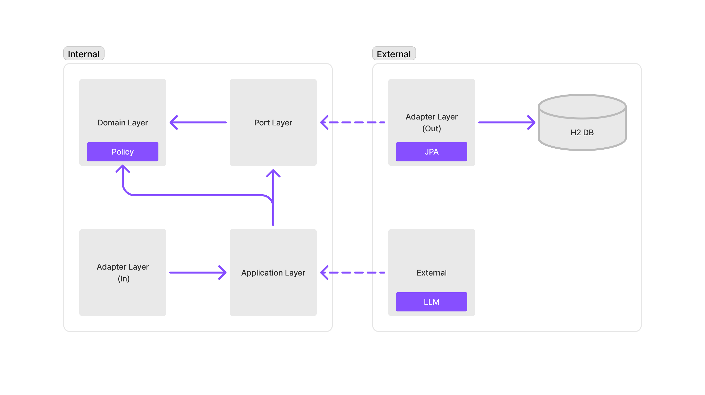
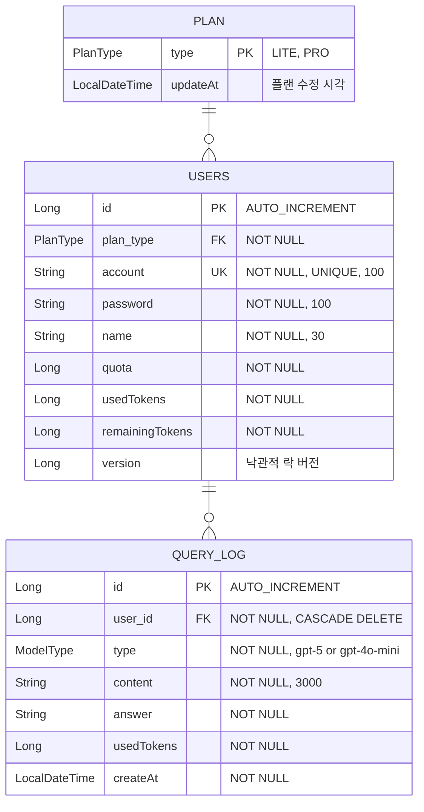

# 유튜브 자막 기반 영어 단어장 생성 서비스
유튜브 영상의 자막을 추출하여 사용자의 니즈에 맞는 도메인별 영어 단어장을 자동 생성하는 서비스입니다.
<br>
<br>

## 목차
|번호| 섹션                    |설명|
|---|-----------------------|---|
|1| [프로젝트 개요](#프로젝트-개요)   |프로젝트 소개 및 개발 목적|
|2| [주요 기능](#주요-기능)       |핵심 기능 및 특징|
|3| [트러블 슈팅](#트러블-슈팅)     |개발 중 발생한 문제점과 해결 과정|
|4| [시스템 아키텍처](#시스템-아키텍처) |전체 시스템 구조 및 기술 스택|
|5| [ERD](#ERD)           |엔티티 관계 다이어그램|
|6| [API 명세](#API-명세)     |REST API 엔드포인트 상세|
|7| [프로젝트 구조](#프로젝트-구조)   |코드 구조 및 패키지 구성|
|8| [실행 방법](#실행-방법)       |로컬 환경 실행 가이드|
|9| [테스트](#테스트)           |테스트 전략 및 커버리지|
<br>

> 각각의 자세한 내용은 Wiki로 이동하는 링크에서 확인 할 수 있습니다.

<br>
<br>

## 프로젝트 개요

### 개발 목적

이 프로젝트는 포지큐브 백엔드 엔지니어 채용 과제로, LLM API 사용량을 효율적으로 관리하고 추적하는 시스템을 구현합니다.

### 개발 목표
```
- ✅ 헥사고날 아키텍처 적용으로 비즈니스 로직과 인프라 계층 분리
- ✅ 동시성 제어 - 낙관적 락을 통한 토큰 차감의 정확성 보장
- ✅ Rate Limiting - Sliding Window 알고리즘 기반 분당 요청 제한
- ✅ 스케줄링 - 매일 자정 자동 토큰 초기화
- ✅ 캐싱 최적화 - Caffeine Cache를 활용한 Rate Limiter 성능 개선
```
**개발 기간**: 2025.11.03 ~ 2025.11.09 (7일)  
**참여 인원**: 개인 프로젝트

<br>
<br>

## 주요 기능
1. 사용자 관리: 계정 생성 및 요금제(LITE/PRO) 선택
2. LLM 질의 처리: 제공된 LlmClient를 통한 외부 API 호출
3. 사용량 조회: gpt-5, gpt-4o-mini 모델별 각각의 토큰 사용량 및 비용 집계
4. 토큰 초기화: 매일 00:00 전체 사용자 토큰 리셋

<br>
<br>

## 트러블 슈팅
| Category        | Topic                            | Detailed Wiki Link                                                            |
|-----------------|----------------------------------|-------------------------------------------------------------------------------|
| **Memory**      | 메모리 누수 문제(Caffeine Cache 도입)     | [자세히 보기](wiki/troubleshooting/1.%20메모리%20누수%20해결-Caffeine%20Cache%20도입.md) |
| **Concurrency** | 동시성 문제 (JVM, Transaction 동시성 제어) | [자세히 보기](wiki/troubleshooting/2.%20동시성%20제어-synchronized+@Transaction%20문제%20해결.md)    |

<br>
<br>

## API 명세

### 1. 사용자 추가 API

```http
POST /users
Content-Type: application/json

{
  "account": "test@gmail.com",
  "password": "123456",
  "name": "test123",
  "plan": "LITE"
}
```

**응답 (201 Created):**

```json
{
  "isSuccess": true,
  "message": "요청에 성공하였습니다.",
  "code": "BASE-1000",
  "httpStatus": "CREATED",
  "result": {
    "account": "test@gmail.com",
    "name": "test123",
    "plan": "LITE",
    "tokens": {
      "quota": 10000,
      "usedTokens": 0,
      "remainingTokens": 10000
    }
  }
}
```

### 2. 질의 API

```http
POST /query
Content-Type: application/json
X-User-Id: 1

{
  "q": "채용 과제를 아래 내용을 참고해서 구현해줘.",
  "model": "gpt-5"
}
```

**응답 (200 OK):**

```json
{
  "isSuccess": true,
  "message": "요청에 성공하였습니다.",
  "code": "BASE-1000",
  "httpStatus": "OK",
  "result": {
    "userName": "test123",
    "answer": "모델 gpt-5로부터의 응답...",
    "model": "gpt-5",
    "usedToken": 25,
    "remainingToken": 9975
  }
}
```

**제약 사항:**

- 분당 30회 요청 제한 (초과 시 429 TOO_MANY_REQUESTS)
- 질의 내용 800자 제한
- 잔여 토큰 부족 시 400 BAD_REQUEST

### 3. 사용량 조회 API

```http
POST /usage
X-User-Id: 1
```

**응답 (200 OK):**

```json
{
  "isSuccess": true,
  "message": "요청에 성공하였습니다.",
  "code": "BASE-1000",
  "httpStatus": "OK",
  "result": {
    "plan": "PRO",
    "quota": 50000,
    "usedTokens": 30000,
    "remainingTokens": 20000,
    "totalPrice": 4.00,
    "models": [
      {
        "name": "gpt-4o-mini",
        "tokens": 10000,
        "price": 1.50
      },
      {
        "name": "gpt-5",
        "tokens": 20000,
        "price": 5.00
      }
    ]
  }
}
```

<br>
<br>

## 시스템 아키텍처


### 기술 스택

| 카테고리         | 기술              | 버전        | 용도              |
| ------------ | --------------- | --------- | --------------- |
| **Backend**  | Java            | 21        | 메인 언어           |
|              | Spring Boot     | 3.5.5     | 애플리케이션 프레임워크    |
|              | Spring Data JPA | 3.5.5     | ORM             |
| **Database** | H2              | In-Memory | 개발/테스트 DB       |
| **Cache**    | Caffeine        | 3.2.3     | Rate Limiter 캐싱 |
| **Build**    | Gradle          | 8.14.3    | 빌드 도구           |
| **Test**     | JUnit 5         | -         | 단위/통합 테스트       |
|              | Mockito         | -         | Mocking 프레임워크   |

<br>
<br>

## ERD


- `USERS.version`: 낙관적 락을 위한 버전 필드
- `USERS.account`: 중복 방지를 위한 Unique 제약
- `QUERY_LOG.user_id`: Cascade 삭제 설정 (사용자 삭제 시 로그도 삭제)

<br>
<br>

## 프로젝트 구조
```
src/main/java/com/posicube/assignment/
│
├── AssignmentApplication.java
├── common
│   ├── baseResponse
│   ├── DataInitializer.java      # Plan 초기 데이터
│   └── exception
│
├── plan                          # 요금제 도메인
│   ├── adapter
│   ├── application
│   ├── domain
│   ├── exception
│   └── port
│
├── querylog                      # 질의 로그 도메인
│   ├── adapter
│   ├── application
│   ├── domain
│   ├── exception
│   └── port
│
└── users                          # 사용자 도메인
    ├── adapter
    ├── application
    ├── domain
    ├── exception
    └── port
```
**패키지 설명:**

- `adapter`: 외부 세계와의 인터페이스 (Web, JPA)
- `application`: 유즈케이스 조율 (Service, Facade)
- `domain`: 비즈니스 핵심 로직 (Entity, Policy)
- `port`: 의존성 역전을 위한 인터페이스

<br>
<br>

## 실행 방법

#### 1. 필수 요구사항

- Java 21
- Gradle 8.x

#### 2. 프로젝트 클론 및 빌드

```bash
cd assignment
./gradlew build
```

#### 3. 애플리케이션 실행

```bash
./gradlew bootRun
```

#### 4. 테스트 실행

```bash
# 전체 테스트
./gradlew test

# 특정 테스트 클래스만
./gradlew test --tests UserServiceConcurrencyTest
```

<br>
<br>

## 테스트

### 테스트 전략

#### 1. 단위 테스트 (Unit Tests)

- **도메인 로직 검증**: Users, QueryLog, Plan 등 핵심 도메인 모델
- **정책 검증**: TokenCalculator, UsageCalculator
- **격리된 테스트**: Mockito를 활용한 의존성 Mock

#### 2. 통합 테스트 (Integration Tests)

- **동시성 테스트**: ExecutorService를 활용한 Race Condition 재현
- **스케줄러 테스트**: TokenResetScheduler 동작 확인
