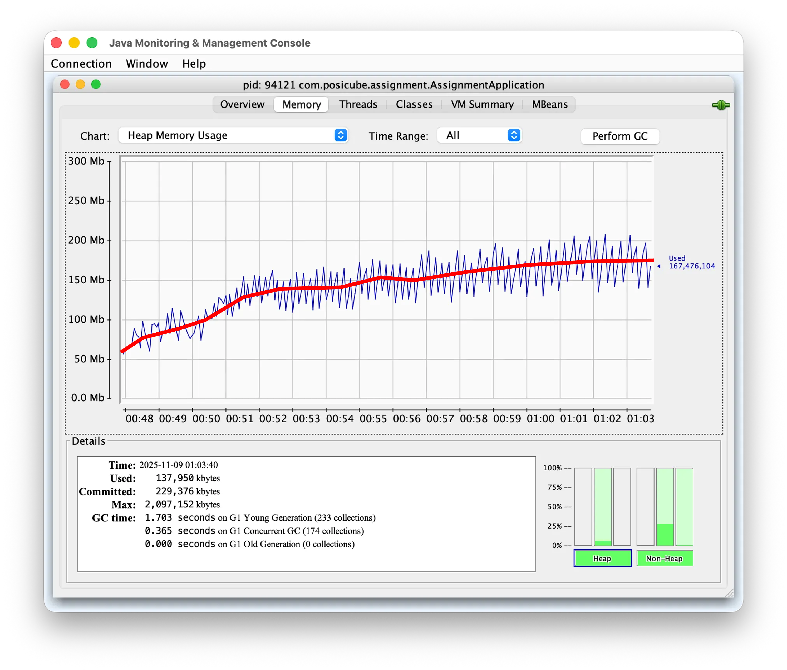
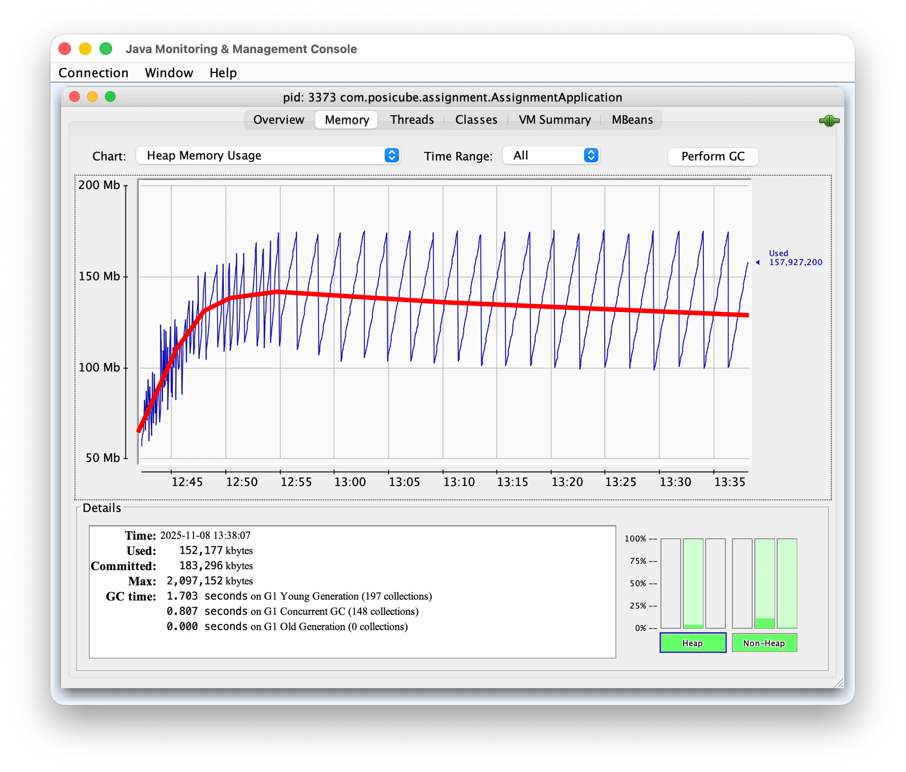

## 목차
| No | Topic                               |
|----|-------------------------------------|
| 1  | [문제 인식 (메모리 누수 코드)](#1-문제-인식)       |
| 2  | [문제 검증 (JConsole 모니터링)](#2-문제-검증)   |   
| 3  | [해결 방안 (trade off)](#3-해결-방안)       |   
| 4  | [구현 (Caffeine Cache)](#4-구현)        |
| 5  | [개선 결과 (JConsole 모니터링)](#5-개선-결과)   |
| 6  | [확장 고려사항 (분산환경, 글로벌캐시)](#6-확장-고려사항) |   
| 7  | [결론](#7-결론)                         |   


## 1. 문제 인식

### 초기 구현의 메모리 누수

```java
@Component
public class InMemoryRateLimiter implements RateLimiter {
    private final Map<Long, Deque<LocalDateTime>> requestTimestamp 
        = new ConcurrentHashMap<>();
    
    @Override
    public boolean isAllowed(Long userId) {
        Deque<LocalDateTime> userTimestamp = requestTimestamp
            .computeIfAbsent(userId, k -> new ConcurrentLinkedDeque<>());
        // Rate Limiting 로직...
    }
}
```

**문제점:**
- `ConcurrentHashMap`에 저장된 사용자 데이터가 **영구적으로 메모리에 잔류**
- 비활성 사용자의 데이터도 계속 남아있음
- 유령 사용자 증가 → 메모리 사용량 선형 증가 → **메모리 누수 발생**

---

## 2. 문제 검증

### 부하 테스트

**테스트 시나리오:**
1. 50,000명의 사용자 생성
2. 각 사용자가 1회 요청 후 이탈 (비활성 사용자 시뮬레이션)
3. 메모리 사용량 모니터링 (JConsole)

```bash
# 1. 대량 사용자 생성
for i in {1..50000}; do 
  curl -X POST http://localhost:8080/users \
    -H "Content-Type: application/json" \
    -d '{"account":"test'$i'","password":"123456","name":"유저'$i'","plan":"LITE"}' \
    -s -o /dev/null &
done

# 2. Query API 호출 (10,000명씩 5회 분산)
for i in {1..50000}; do
  curl -X POST http://localhost:8080/query \
    -H "X-User-Id: $i" \
    -H "Content-Type: application/json" \
    -d '{"q":"테스트 쿼리","model":"gpt-4o-mini"}' \
    -s -o /dev/null &
done
```

### 메모리 누수 확인

**JConsole 모니터링 결과 (개선 전)**



**주요 지표:**

| 지표 | 측정값           | 문제점                          |
|-----|---------------|------------------------------|
| Heap Memory Used | 167 MB        | 메모리 측정값의 지속적 상승              |
| 메모리 패턴 | 톱니 형태 상승      | **하한선 지속 상승** (50→100→150MB) |

**문제 원인:**
- GC 후에도 메모리가 회수되지 않음
- 50,000명의 비활성 사용자 데이터가 메모리 점유

---

## 3. 해결 방안

### 기술 비교

| 구분         | TTL 스케줄러 | LRU Cache | Caffeine Cache | Redis |
|------------|------------|-----------|----------------|-------|
| **구현 복잡도** | 중 | 중 | **낮음** | 높음 |
| **메모리 관리** | 수동 (주기적 스캔) | 수동 (크기 제한) | **자동 (TTL+LRU)** | 외부 메모리 |
| **의존성**    | In-Memory | In-Memory | **In-Memory** | 외부 의존성 |

**Caffeine Cache 선택 이유:**
1. 간단한 구현
2. TTL + LRU 하이브리드로 자동 메모리 관리
3. Window TinyLFU 알고리즘으로 높은 캐시 히트율
4. 외부 인프라 불필요 (설정만으로 사용 가능)

---

## 4. 구현

### Caffeine Cache 적용

**의존성 추가 (build.gradle):**
```gradle
dependencies {
    implementation 'com.github.ben-manes.caffeine:caffeine:3.1.8'
}
```

**개선된 RateLimiter:**

```java
@Slf4j
@Component
public class InMemoryRateLimiterWithCaffeine implements RateLimiter {
    private static final int MAX_REQUEST = 30;
    private static final int TIME_WINDOW_IN_MINUTE = 1;
    private static final int CACHE_EXPIRE_MINUTES = 5;      // 5분 TTL
    private static final int MAX_CACHE_SIZE = 10_000;       // LRU 10,000명

    private final Cache<Long, Deque<LocalDateTime>> requestTimestamp;

    public InMemoryRateLimiterWithCaffeine() {
        this.requestTimestamp = Caffeine.newBuilder()
                .maximumSize(MAX_CACHE_SIZE)                              // LRU
                .expireAfterAccess(CACHE_EXPIRE_MINUTES, TimeUnit.MINUTES) // TTL
                .recordStats()
                .removalListener((userId, value, cause) -> 
                    log.debug("사용자 {}, 캐시 제거 ({})", userId, cause))
                .build();
    }

    @Override
    public boolean isAllowed(Long userId) {
        LocalDateTime now = LocalDateTime.now();
        LocalDateTime windowStart = now.minusMinutes(TIME_WINDOW_IN_MINUTE);

        Deque<LocalDateTime> userTimestamp 
            = requestTimestamp.get(userId, k -> new ConcurrentLinkedDeque<>());

        synchronized (userTimestamp) {
            // Sliding Window: 1분 이전 요청 제거
            while (!userTimestamp.isEmpty() && 
                   userTimestamp.peekFirst().isBefore(windowStart)) {
                userTimestamp.pollFirst();
            }

            if (userTimestamp.size() < MAX_REQUEST) {
                userTimestamp.add(now);
                return true;
            }
        }
        return false;
    }
}
```

### 핵심 설정

| 설정 | 값 | 역할 |
|-----|---|------|
| `maximumSize` | 10,000 | LRU: 10,000명 초과 시 가장 오래된 항목 제거 |
| `expireAfterAccess` | 5분 | TTL: 5분간 미접근 시 자동 삭제 |

---

## 5. 개선 결과

### 동일 부하 테스트 재실행

**JConsole 모니터링 결과 (개선 후)**



> 사용되지 않는 메모리는 시간이 지남에 따라 자동으로 삭제되므로 안정적인 메모리 생성, 삭제 폭 유지

### 성능 지표 비교

| 지표 | 개선 전 | 개선 후           | 개선율 |
|-----|--------|----------------|-------|
| Heap Memory Used | 167MB (증가 중) | **130MB (안정)** | - |
| 메모리 패턴 | 하한선 상승 | **안정된 톱니**   | - |

**핵심 개선 사항:**
1. **메모리 누수 해결**: 비활성 사용자 데이터 자동 제거
2. **메모리 하한선 유지**: GC 후 메모리가 100MB 수준으로 안정

---

## 6. 확장 고려사항

### RateLimiter 인터페이스 유지

```java
public interface RateLimiter {
    boolean isAllowed(Long userId);
}
```

**구현체 교체 가능:**

```java
// 개발 환경
@Component
@Profile("dev")
public class InMemoryRateLimiterWithCaffeine implements RateLimiter { }

// 프로덕션 환경
@Component
@Profile("prod")
public class RedisRateLimiter implements RateLimiter {
    // Redis + Lua Script로 분산 환경 대응
}
```

**환경별 선택 가이드:**
- 현재는 단일 환경에서 구현된 캐시이기 때문에 분산 서버의 경우 캐시가 중복될 수 있다. 따라서 글로벌 캐시로 관리해야 데이터 정합성을 지킬 수 있다.

| 환경 | 선택 | 이유                    |
|-----|------|-----------------------|
| **단일 서버** | Caffeine Cache | In-Memory, 설치 불필요     |
| **분산 환경** | Redis | 서버 간 상태 공유, 글로벌 캐시 관리 |

---

## 7. 결론

### 핵심 성과
1. 메모리 누수 해결 (비활성 사용자 자동 제거)
2. 메모리 사용량 안정화 (155MB 유지)
3. 확장 가능한 설계 (Redis 교체 가능)