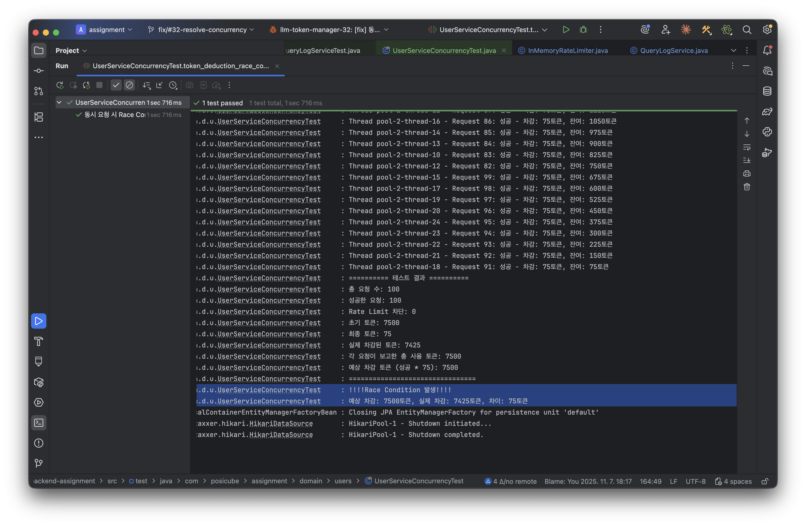
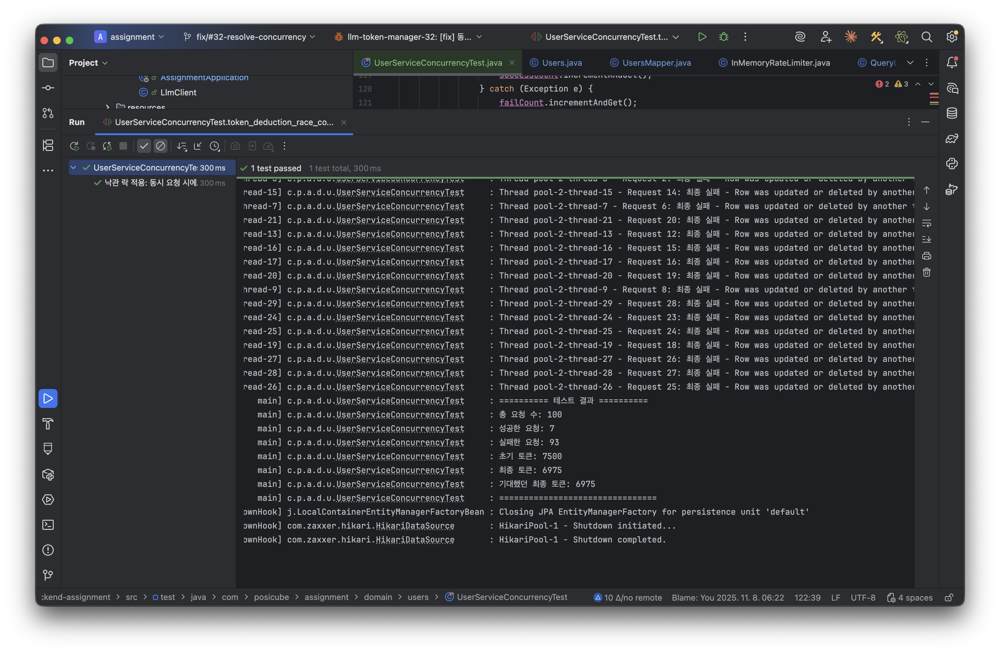

## 목차
```
1. 문제 인식
2. 핵심 개념
3. 문제 분석
4. 문제 재현
5. 해결 방안: 낙관적 락 (@Version)
6. 검증 결과
7. 추가 고려사항
```

---

## 1. 문제 인식

### 초기 구현의 동시성 문제
단일 서버 환경에서 정상 동작하던 토큰 차감 로직이 동시 요청(100회 이상) 상황에서 잔여 토큰 불일치 현상이 발생했다.
문제의 핵심은 synchronized와 @Transactional이 서로 다른 계층(JVM vs DB) 을 보호하고 있었기 때문이다.

**문제가 된 코드:**
```java
@Service
@RequiredArgsConstructor
public class QueryLogService {

    @Transactional
    public synchronized QueryResponse submitQuery(Long userId, QueryRequest request) {
        Users user = usersRepository.findUserById(userId)
                .orElseThrow(() -> new BaseException(UserExceptionStatus.USER_NOT_FOUND));

        // Rate Limit 검증
        if (!rateLimiter.isAllowed(userId)) {
            throw new BaseException(QueryLogExceptionStatus.TOO_MANY_REQUESTS);
        }

        // 토큰 차감
        user.validateQueryPermission();
        Long usedTokens = tokenCalculator.calculateTokensFromPrompt(request.q());
        Users userWithTokensUsed = user.useTokens(usedTokens);

        // DB 저장
        Users updatedUser = usersRepository.save(userWithTokensUsed);
        // ...
    }
}
```

**문제점:**
- 단일 서버 테스트에서는 성공
- `synchronized` + `@Transactional` 조합은 **분산 환경에서 무효**
- 높은 트래픽 시 **토큰 차감 불일치 (Lost Update)** 발생

---

## 2. 핵심 개념

### 1. 모니터 락 (synchronized)

**동작 방식:**
- 한 번에 하나의 스레드만 임계 영역(critical section)에 접근 가능
- 나머지 스레드들은 BLOCKED 상태로 대기
- **JVM 메모리(힙) 내부**에서만 동작

**한계:**
```
Server1          Server2
[스레드1] 🔒     [스레드2] 🔒
    ↓                ↓
  같은 DB 행에 동시 접근 → race condition 발생!
→ 단일 서버 내부에서만 유효, 분산 환경에서는 무용지물
```

### 2. `@Transactional` (Spring AOP 프록시)
Spring AOP(Aspect-Oriented Programming)를 사용해 트랜잭션 관리
메서드 호출 시 실제 메서드 대신 프록시 객체가 먼저 실행
```
프록시 실행 흐름:
java프록시.메서드() {
    1. 트랜잭션 시작 (BEGIN)
    2. 실제 메서드 실행
    3. 트랜잭션 커밋 (COMMIT) 또는 롤백 (ROLLBACK)
}
```
**핵심 문제:**
`@Transactional`은 단일 트랜잭션 내부의 원자성만 보장
여러 트랜잭션 간의 동시성 제어는 하지 않음

---

## 3. 문제 상황

### a. Race Condition 시나리오
초기 잔여 토큰: **7,500**

|**순서**|**스레드 1**|**스레드 2**|
|---|---|---|
|1|@Transactional 진입||
|2|TX1 BEGIN (1ms)||
|3|synchronized 락 획득||
|4|SELECT: 7,500 (10ms)||
|5|계산: 7,500 - 75 = 7,425||
|6|메모리에 7,425 저장||
|7|Thread.sleep(10)||
|8|synchronized 해제 ✓||
|9||synchronized 락 획득 ✓|
|10||SELECT: 7,500 (!!!) ❌|
|11||계산: 7,500 - 75 = 7,425|
|12||메모리에 7,425 저장|
|13||synchronized 해제|
|14|TX1 COMMIT → DB에 7,425 쓰기||
|15||TX2 COMMIT → DB에 7,425 쓰기|

**최종 결과:** 7,425 (**잘못됨, 7,350이어야 함**)

### b. 부하 테스트 (100 동시 요청)
   

**주요 지표:**
- **총 요청 수**: 100
- **성공한 요청**: 100 (Rate Limiter 통과)
- **초기 토큰**: 7,500
- **최종 토큰**: 7,425 (예상: 0, **실제: 7,425**)
- **손실된 차감**: 75 토큰 (1회 요청분)
- **에러 메시지**: `Race Condition 발생!!!!`
---

## 4. 문제 분석
### a. 동기화 메커니즘 계층 불일치
| 메커니즘 | 계층 | 보호 대상 | 범위 |
|---------|------|----------|------|
| `synchronized` | Application Layer (JVM) | 메모리 접근 | 단일 서버 내 |
| `@Transactional` | Database Layer | DB 작업의 원자성 | 트랜잭션 내부 |
**결론:**
- **서로 다른 계층**에서 동작하므로 **연계가 안됨**
- JVM 락이 해제되면 다른 스레드가 들어올 수 있지만, DB 락은 아직 유지 중

---

## 5. 해결 방안: 낙관적 락 (@Version)

### a. 후보 기술 비교

| 구분 | 비관적 락 | 낙관적 락 | 분산 락 (Redis) |
|------|----------|----------|----------------|
| **동작 방식** | SELECT FOR UPDATE | @Version 체크 | Redis SETNX |
| **성능** | 낮음 (DB 락 대기) | **높음 (락 없음)** | 중간 (네트워크 I/O) |
| **충돌 처리** | 대기 → 순차 처리 | **충돌 시 재시도** | 대기 → 순차 처리 |
| **확장성** | 단일 DB | 단일 DB | **분산 환경** |
| **구현 복잡도** | 낮음 | **낮음 (JPA 지원)** | 높음 (인프라 필요) |
| **적합 상황** | 충돌 빈번 | **충돌 드묾** | 다중 서버 |

### b. 낙관적 락 선택 이유
#### **성능과 정합성의 균형**
- 토큰 차감은 **매우 빈번하게** 발생할 수 있는 작업
- 비관적 락: 확실하지만 **DB 락 대기**로 인한 성능 저하 우려

#### **충돌 가능성 분석**
- 현재 시나리오: **Rate Limiter가 분당 30회로 제한**
- 실제 환경에서 정확히 동일한 사용자의 토큰을 **수 밀리초(ms) 안에 동시에 변경**하려는 충돌 확률은 **매우 낮음**
- "충돌은 드물다"는 낙관적 락의 가정이 **잘 들어맞음**

> 비관적 락: DB 대기 → 성능 저하  
> 분산 락: Redis 필요 → 과제 In-Memory 위배

### c. 구현

#### Entity에 `@Version` 추가
```java
@Entity
public class UsersJpaEntity {
    // ...
    @Version
    private Long version;  // 자동 충돌 감지
}
```

#### Facade 패턴으로 관심사 분리
```java
@Component
@RequiredArgsConstructor
public class QueryLogFacade {
    private final QueryLogService service;
    private final RateLimiter rateLimiter;

    private static final int MAX_RETRY = 5;

    public QueryResponse submitQuery(Long userId, QueryRequest request) {
        // Rate Limit (HTTP 요청 기준)
        if (!rateLimiter.isAllowed(userId)) {
            throw new BaseException(TOO_MANY_REQUESTS);
        }

        // 낙관적 락 재시도
        int attempt = 0;
        while (attempt < MAX_RETRY) {
            try {
                return service.submitQuery(userId, request);
            } catch (OptimisticLockException e) {
                attempt++;
                Thread.sleep(50 * attempt); // 지수 백오프
            }
        }
        throw new BaseException(TOO_MANY_CONCURRENT_REQUESTS);
    }
}
```

#### Service (비즈니스 로직만)
```java
@Service
@Transactional
public class QueryLogService {
    public QueryResponse submitQuery(Long userId, QueryRequest request) {
        Users user = findUser(userId);
        user.validateQueryPermission();

        Long usedTokens = tokenCalculator.calculate(...);
        String answer = llmClient.query(...);

        Users updated = usersRepository.save(user.useTokens(usedTokens));
        // 로그 저장
        return QueryResponse.of(...);
    }
}
```

---

## 6. 검증 결과


### 동시성 테스트 (100 요청)
| 지표 | 값           |
|------|-------------|
| **성공 요청** | 7           |
| **초기 토큰** | 7,500       |
| **최종 토큰** | 6,975 (정확!) |
| **정확도** | 100%        |

---

## 7. 추가 고려사항

- **분산 환경**: Redis를 이용한 분산 락 구현